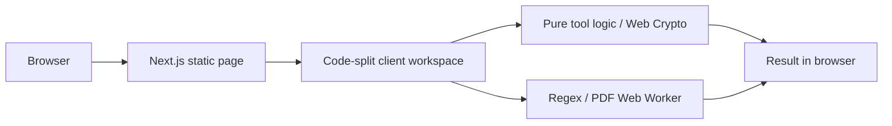

# Meaw Tools

ศูนย์รวมเครื่องมือออนไลน์สำหรับคนทำงานและนักพัฒนาไทย ครอบคลุมงานเอกสาร การคำนวณ JSON, SQL, JWT, Base64, Regex, Diff และข้อมูลอื่น ๆ ภายใน Browser โดยไม่ส่งเนื้อหาเครื่องมือไปยัง Server

## สถานะ MVP

- Next.js 16 App Router, React 19, TypeScript strict และ Tailwind CSS 4
- shadcn/ui + Radix, Noto Sans Thai, JetBrains Mono และ dark mode
- เครื่องมือ 35 รายการ พร้อม validation, empty/error state, example, clear และ copy
- กลุ่มงานทั่วไป: นับคำ จัดระเบียบข้อความ คำนวณเปอร์เซ็นต์ แปลงหน่วย และคำนวณวัน
- JPG to PDF, QR Code Generator และ Age Calculator ประมวลผลภายใน Browser
- Loan Calculator, BMI Calculator และ Profit & Margin Calculator พร้อมสูตรและข้อจำกัดที่ตรวจสอบได้
- PNG to JPG และ Image Compressor & Resizer รองรับ JPG, PNG, WebP โดยประมวลผลใน Browser
- Color Picker/Contrast, Password Generator และ Random Number Generator ใช้สูตรที่ทดสอบได้และ Web Crypto
- PDF to JPG, Merge PDF และ Split PDF ใช้ PDF.js, pdf-lib และ ZIP ภายใน Browser โดยไม่อัปโหลดเอกสาร
- หน้า `/categories` และหน้า Tag รายหมวด พร้อมจำนวนเครื่องมือ metadata และ sitemap
- Static tool routes พร้อม metadata, JSON-LD, sitemap และ robots
- CSP และ security headers; ไม่มี API route, database, authentication หรือ AI API
- Vitest, React Testing Library และ Playwright

## เริ่มใช้งาน

```powershell
npm install
Copy-Item .env.example .env.local
npm run dev
```

เปิด `http://localhost:3000`

## คำสั่งตรวจสอบ

```powershell
npm run lint
npm run typecheck
npm run test
npm run build
```

E2E ต้องติดตั้ง Playwright browser ครั้งแรก:

```powershell
npx playwright install chromium
npm run test:e2e
```

หรือรันทุก quality gate ยกเว้น E2E:

```powershell
npm run check
```

## Architecture



หน้าและ SEO render แบบ Server Component/Static HTML ส่วน interaction และ input อยู่ใต้ Client Component ขนาดเล็ก แต่ละเครื่องมือโหลด chunk ของตัวเอง จึงไม่ดึง `sql-formatter`, CodeMirror, `jose`, `pdfjs-dist`, ONNX Runtime Web และ `diff` พร้อมกันในหน้าแรก โมเดล Background Remover จะเริ่มดาวน์โหลดเมื่อผู้ใช้กดประมวลผลเท่านั้น

## Privacy และ Security

- ไม่มี route handler หรือ server action ที่รับ tool input
- ไม่บันทึก JSON, SQL, JWT, source code หรือไฟล์ลง LocalStorage
- LocalStorage ใช้เก็บ theme preference และสถานะเปิด/ปิดมาสคอตแมวเท่านั้น ไม่เก็บข้อมูลในเครื่องมือ
- จำกัดข้อความทั่วไป 2 MB, Diff 1 MB ต่อฝั่ง, Regex 100,000 ตัวอักษร ไฟล์ทั่วไป 5 MB รูปภาพ 10 MB และ PDF 30 MB ต่อไฟล์
- Regex ทำงานใน Web Worker และถูก terminate เมื่อเกิน 750 ms
- JWT เป็นการ Decode เท่านั้น ไม่ verify signature
- SQL ถูกจัดรูปเท่านั้น ไม่ execute
- Analytics และ AdSense ปิดเป็นค่าเริ่มต้นผ่าน `.env.example`

## เพิ่มเครื่องมือใหม่

1. เพิ่ม metadata ใน `src/config/tools.ts`
2. เพิ่ม client workspace ภายใต้ `src/features/tools/`
3. เพิ่ม dynamic import ใน `src/components/tools/tool-renderer.tsx`
4. เพิ่ม unit test ของ business logic

Route, metadata, sitemap, FAQ schema และ related tools จะใช้ registry กลางโดยอัตโนมัติ

ดูลำดับการพัฒนาชุดถัดไปได้ที่ [docs/tool-roadmap.md](docs/tool-roadmap.md)

## Deploy บน Vercel

1. Import repository ใน Vercel
2. Framework preset: Next.js
3. Build command: `npm run build`
4. ตั้ง `NEXT_PUBLIC_SITE_URL` เป็น production domain
5. คง `NEXT_PUBLIC_ADSENSE_ENABLED=false` และ `NEXT_PUBLIC_VERCEL_ANALYTICS_ENABLED=false` จนกว่าจะอัปเดต privacy policy และ CSP สำหรับบริการนั้น

โปรเจกต์ไม่ต้องใช้ database, storage, login หรือ paid service จึงใช้งานบน Vercel Hobby ได้
