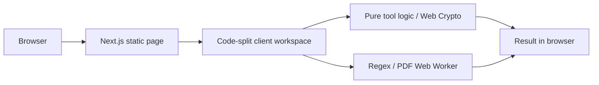

# Meaw Tools

ศูนย์รวมเครื่องมือออนไลน์สำหรับคนทำงานและนักพัฒนาไทย ครอบคลุมงานเอกสาร การคำนวณ JSON, SQL, JWT, Base64, Regex, Diff และข้อมูลอื่น ๆ ภายใน Browser โดยไม่ส่งเนื้อหาเครื่องมือไปยัง Server

## สถานะ MVP

- Next.js 16 App Router, React 19, TypeScript strict และ Tailwind CSS 4
- shadcn/ui + Radix, Noto Sans Thai, JetBrains Mono และ dark mode
- เครื่องมือ 67 รายการ พร้อม validation, empty/error state, clear และ action ที่เหมาะกับแต่ละงาน
- กลุ่มงานทั่วไป: นับคำ จัดระเบียบข้อความ คำนวณเปอร์เซ็นต์ แปลงหน่วย และคำนวณวัน
- Word Cloud Generator ตัดคำไทย/อังกฤษ กรอง stopwords รองรับวลีพร้อมน้ำหนัก ปรับสี/พื้นหลัง และส่งออก PNG 2×, SVG หรือ CSV ภายใน Browser
- Business Days Calculator นับช่วงวันหรือเพิ่ม/ลบวันทำการ ปรับสัปดาห์ทำงาน ตัดวันหยุดกำหนดเอง และใช้ preset วันหยุดสถาบันการเงิน ธปท. ปี 2569 แบบระบุขอบเขต
- Working Hours Calculator รวมเวลาเข้า–ออกหลายกะ หักพัก รองรับกะข้ามวัน ปัดเวลาสุทธิแบบเปิดเผย แสดงชั่วโมงทศนิยม เทียบเป้าหมาย และดาวน์โหลด CSV
- Shift Pattern Calculator วางรอบกะซ้ำและกะข้ามวันบนปฏิทินรายเดือน เลือกวันเริ่มกลางรอบ สรุปชั่วโมง และส่งออก CSV/ICS
- Hourly Rate Calculator แปลงค่าจ้างรายชั่วโมง/วัน/สัปดาห์/เดือน/ปี และย้อนหาเรทฟรีแลนซ์จากรายได้ ต้นทุน เงินสำรอง เวลาที่ขายได้ ค่าธรรมเนียม และราคาโปรเจกต์
- JPG to PDF, QR Code Generator, QR Code Scanner และ Age Calculator ประมวลผลภายใน Browser
- Loan Calculator, BMI Calculator และ Profit & Margin Calculator พร้อมสูตรและข้อจำกัดที่ตรวจสอบได้
- VAT Calculator Thailand บวกหรือถอด VAT ด้วยสูตรที่อธิบายได้ รองรับ Service Charge และแยกภาษีหัก ณ ที่จ่าย พร้อมอัตรา versioned จากกรมสรรพากร
- Quotation Generator สร้างใบเสนอราคาภาษาไทยพร้อมตัวอย่าง ยอดเป็นตัวอักษร VAT และ PDF A4 ภายใน Browser
- Thai Income Tax, Salary/Payslip Checker และ Social Security Pension Calculator ใช้สูตรแบบ versioned พร้อมแหล่งราชการ
- Overtime Calculator Thailand คำนวณฐานต่อชั่วโมงและแยก OT วันทำงาน 1.5 เท่า ทำงานวันหยุด 1/2 เท่า และ OT วันหยุด 3 เท่า พร้อมแหล่งกระทรวงแรงงาน
- Fuel Cost Calculator คำนวณค่าน้ำมันเที่ยวเดียว/ไป-กลับจาก กม./ลิตร หรือ L/100 km รวมทางด่วน จอดรถ ต้นทุนต่อกิโลเมตร และหารต่อคน
- Thai ID Checksum Validator ตรวจเฉพาะโครงสร้างใน Browser ซ่อนค่าที่กรอก และไม่อ้างว่าเชื่อมฐานข้อมูลรัฐ
- HEIC to JPG, JPG to PNG Batch, PNG to JPG และ Image Compressor & Resizer แปลงและย่อรูปใน Browser โดยโหลด codec หรือ ZIP เฉพาะเมื่อใช้งาน
- QR Code Scanner อ่านจากรูปหรือกล้องแบบ lazy-loaded หยุดกล้องเมื่ออ่านสำเร็จ และไม่เปิดลิงก์อัตโนมัติ
- Image to Text OCR อ่านภาษาไทยและอังกฤษจากรูปใน Browser พร้อมแก้ไข คัดลอก และดาวน์โหลด TXT โดย self-host Runtime และโมเดลภาษา
- Typing Test รองรับข้อความฝึกภาษาไทย/อังกฤษ พร้อม WPM, CPM, accuracy และการแบ่งอักขระผสมภาษาไทย
- Special Characters & Fancy Text สร้างข้อความ Unicode แต่งชื่อไทย/อังกฤษ และค้นหาสัญลักษณ์ตาม intent ภาษาไทย
- Text to Speech Reader อ่านข้อความไทย/อังกฤษด้วยเสียงจาก Browser หรือระบบ พร้อมความเร็ว โทนเสียง ความดัง และพัก/อ่านต่อ โดยไม่ใช้ API Key
- Barcode Generator สร้าง Code 128, EAN-13, EAN-8, UPC-A, ITF-14 และ Code 39 หลายรายการจากข้อมูลที่วางจาก Excel พร้อมตรวจ Check Digit และดาวน์โหลด PNG/SVG/ZIP
- Grade Calculator คำนวณ GPA จากรายวิชาและประมาณ GPAX หลายเทอมแบบถ่วงหน่วยกิต พร้อมเทียบค่าปัดกับค่าตัดทศนิยม
- CSV to Excel Converter อ่าน CSV/TSV/TXT ด้วย UTF-8 หรือ Windows-874 ตรวจคอลัมน์ใน Web Worker และสร้าง .xlsx โดยรักษาเลขศูนย์นำหน้าและไม่สร้างสูตรจากข้อมูล
- Excel to CSV Converter อ่าน .xlsx ใน Web Worker เลือก Worksheet, ตัวคั่น, UTF-8 BOM และส่งออกทุกชีตเป็น ZIP ได้โดยไม่อัปโหลด Workbook
- CSV Cleaner & Duplicate Finder ตัดช่องว่าง ลบแถวว่าง ตรวจ/ลบข้อมูลซ้ำตามคอลัมน์ และสร้าง UTF-8 CSV ที่ป้องกัน Formula Injection ใน Web Worker
- UTM Link Builder สร้าง Campaign URL สำหรับ GA4 โดยรักษา query/hash เดิม จัด naming convention และเตือนการใช้ร่วมกับ Google Ads auto-tagging
- Markdown Table Generator วางข้อมูลจาก Excel/Sheets/CSV/TSV แก้ไขตาราง จัดแนว Escape Pipe และสร้าง GitHub Flavored Markdown ใน Browser
- HTML Table Generator วางข้อมูลจาก Excel/Sheets/CSV/TSV แก้ไขและรวมเซลล์ สร้าง caption, thead/tbody, scope, colspan/rowspan และ CSS แบบ responsive ใน Browser
- Image Cropper ครอปกรอบอิสระ/วงกลม เลือกสัดส่วน หมุน พลิก กำหนดพิกเซล และส่งออก PNG/JPG/WebP โดยไม่อัปโหลดรูป
- Favicon & PWA Icon Generator สร้าง ICO หลายขนาด, PNG, Apple touch, PWA any/maskable, Web Manifest, HTML และ ZIP ภายใน Browser
- Resume Builder สร้างเรซูเม่ไทย/อังกฤษแบบ Single column พร้อม Live Preview, PDF A4 ที่มี text layer, Plain text และ Keyword coverage โดยไม่ส่งข้อมูลส่วนตัวไป Server
- Color Picker/Contrast, Password Generator และ Random Number Generator ใช้สูตรที่ทดสอบได้และ Web Crypto
- PDF to JPG, Merge PDF, Split PDF, PDF Organizer และ Sign PDF ใช้ PDF.js, pdf-lib และ ZIP ภายใน Browser โดยไม่อัปโหลดเอกสาร
- หน้า `/categories` และหน้า Tag รายหมวด พร้อมจำนวนเครื่องมือ metadata และ sitemap
- Static tool routes พร้อม metadata, JSON-LD, sitemap และ robots
- CSP และ security headers; ไม่มี API route, database, authentication หรือ AI API
- Vitest, React Testing Library และ Playwright

## เริ่มใช้งาน

```powershell
npm install
Copy-Item .env.example .env.local
npm run dev
```

เปิด `http://localhost:3000`

## คำสั่งตรวจสอบ

```powershell
npm run lint
npm run typecheck
npm run test
npm run build
```

E2E ต้องติดตั้ง Playwright browser ครั้งแรก:

```powershell
npx playwright install chromium
npm run test:e2e
```

หรือรันทุก quality gate ยกเว้น E2E:

```powershell
npm run check
```

## Architecture



หน้าและ SEO render แบบ Server Component/Static HTML ส่วน interaction และ input อยู่ใต้ Client Component ขนาดเล็ก แต่ละเครื่องมือโหลด chunk ของตัวเอง จึงไม่ดึง `sql-formatter`, CodeMirror, `jose`, `pdfjs-dist`, Tesseract.js, ONNX Runtime Web และ `diff` พร้อมกันในหน้าแรก โมเดล Background Remover และ OCR จะเริ่มดาวน์โหลดเมื่อผู้ใช้กดประมวลผลเท่านั้น

## Privacy และ Security

- ไม่มี route handler หรือ server action ที่รับ tool input
- ไม่บันทึก JSON, SQL, JWT, source code หรือไฟล์ลง LocalStorage
- LocalStorage ใช้เก็บ theme preference และสถานะเปิด/ปิดมาสคอตแมวเท่านั้น ไม่เก็บข้อมูลในเครื่องมือ
- จำกัดข้อความทั่วไป 2 MB, Diff 1 MB ต่อฝั่ง, Regex 100,000 ตัวอักษร ไฟล์ทั่วไป 5 MB รูปภาพ 10 MB และ PDF 30 MB ต่อไฟล์
- OCR ลดด้านยาวของรูปทำงานเหลือสูงสุด 2,400 px, ปิด Worker หลังจบงาน และไม่ส่งรูปไปยัง Server
- Text to Speech จำกัด 20,000 ตัวอักษรและไม่ส่งข้อความมายัง Server ของเรา แต่เสียงออนไลน์ของ Browser/OS อาจใช้บริการภายนอก จึงไม่ควรใส่ข้อมูลลับ
- JPG to PNG Batch จำกัด 20 ไฟล์ ไฟล์ละ 10 MB รวม 50 MB และผลลัพธ์รวม 120 ล้านพิกเซล พร้อมประมวลผลทีละรูปและไม่คัดลอก metadata เดิม
- Excel to CSV จำกัด 10 MB, 50 Worksheet, 50,000 แถวต่อชีต, 200 คอลัมน์ และ 500,000 เซลล์รวม พร้อมหยุด Worker เมื่อยกเลิกหรือหมดเวลา
- HTML Table Generator escape ข้อความในเซลล์และ caption ก่อน Preview/Export จำกัด 100 แถว, 20 คอลัมน์ และ 1,000 ตัวอักษรต่อเซลล์
- Image Cropper จำกัดไฟล์ 10 MB / 40 ล้านพิกเซล และผลลัพธ์ด้านยาว 8,000 px / 24 ล้านพิกเซล พร้อมปิด ImageBitmap และ Blob URL เมื่อเลิกใช้
- Favicon Generator จำกัดต้นฉบับ 10 MB / 40 ล้านพิกเซล รับเฉพาะ PNG/JPG/WebP และคืน ImageBitmap กับ Blob URL เมื่อเปลี่ยนงานหรือออกจากหน้า
- Resume Builder จำกัดข้อความรวม 20,000 ตัวอักษร, Job Description 12,000 ตัวอักษร, ประสบการณ์ 8 และการศึกษา 6 รายการ ไม่บันทึกลง LocalStorage และไม่อ้างรับประกันผล ATS
- Fuel Cost Calculator ไม่ดึงพิกัดหรือราคาน้ำมันอัตโนมัติ ระยะทาง ราคา และค่าใช้จ่ายอยู่ใน state ของหน้าปัจจุบันและไม่ถูกส่งไป Server
- Word Cloud Generator จำกัดข้อความ 100,000 ตัวอักษรและรายการถ่วงน้ำหนัก 20,000 ตัวอักษร escape ข้อความก่อนสร้าง SVG และไม่ส่งข้อความหรือภาพขึ้น Server
- Business Days Calculator จำกัดช่วง 3,660 วัน การเลื่อน 5,000 วันทำการ และวันหยุดกำหนดเอง 500 รายการ โดย preset ธปท. ครอบคลุมเฉพาะปี 2569 และไม่อ้างว่าเป็นวันหยุดของทุกองค์กร
- Working Hours Calculator จำกัด 62 กะต่อครั้ง เวลาพักไม่เกิน 720 นาทีต่อกะ และไม่บันทึก Timesheet ลง LocalStorage หรือ Server
- Shift Pattern Calculator จำกัดช่วง 366 วัน รอบกะ 56 วัน และประเภทกะ 6 แบบต่อครั้ง โดยไม่บันทึกตารางลง LocalStorage หรือ Server
- Hourly Rate Calculator จำกัดค่าเงินต่อช่อง 1 ล้านล้าน ชั่วโมงต่อสัปดาห์ 168 และสัปดาห์ต่อปี 53 พร้อมปฏิเสธสมมติฐานเวลาที่เกิน 24 ชั่วโมงต่อวัน และไม่บันทึกรายได้หรือต้นทุน
- Regex ทำงานใน Web Worker และถูก terminate เมื่อเกิน 750 ms
- JWT เป็นการ Decode เท่านั้น ไม่ verify signature
- SQL ถูกจัดรูปเท่านั้น ไม่ execute
- Analytics และ AdSense ปิดเป็นค่าเริ่มต้นผ่าน `.env.example`

## เพิ่มเครื่องมือใหม่

1. เพิ่ม metadata ใน `src/config/tools.ts`
2. เพิ่ม client workspace ภายใต้ `src/features/tools/`
3. เพิ่ม dynamic import ใน `src/components/tools/tool-renderer.tsx`
4. เพิ่ม unit test ของ business logic

Route, metadata, sitemap, FAQ schema และ related tools จะใช้ registry กลางโดยอัตโนมัติ

ดูลำดับการพัฒนาชุดถัดไปได้ที่ [docs/tool-roadmap.md](docs/tool-roadmap.md)

## Deploy บน Vercel

1. Import repository ใน Vercel
2. Framework preset: Next.js
3. Build command: `npm run build`
4. ตั้ง `NEXT_PUBLIC_SITE_URL` เป็น production domain
5. คง `NEXT_PUBLIC_ADSENSE_ENABLED=false` และ `NEXT_PUBLIC_VERCEL_ANALYTICS_ENABLED=false` จนกว่าจะอัปเดต privacy policy และ CSP สำหรับบริการนั้น

โปรเจกต์ไม่ต้องใช้ database, storage, login หรือ paid service จึงใช้งานบน Vercel Hobby ได้

## Third-party notices

รายละเอียดไลบรารีและ WebAssembly ภายนอกอยู่ใน [THIRD_PARTY_NOTICES.md](THIRD_PARTY_NOTICES.md)
